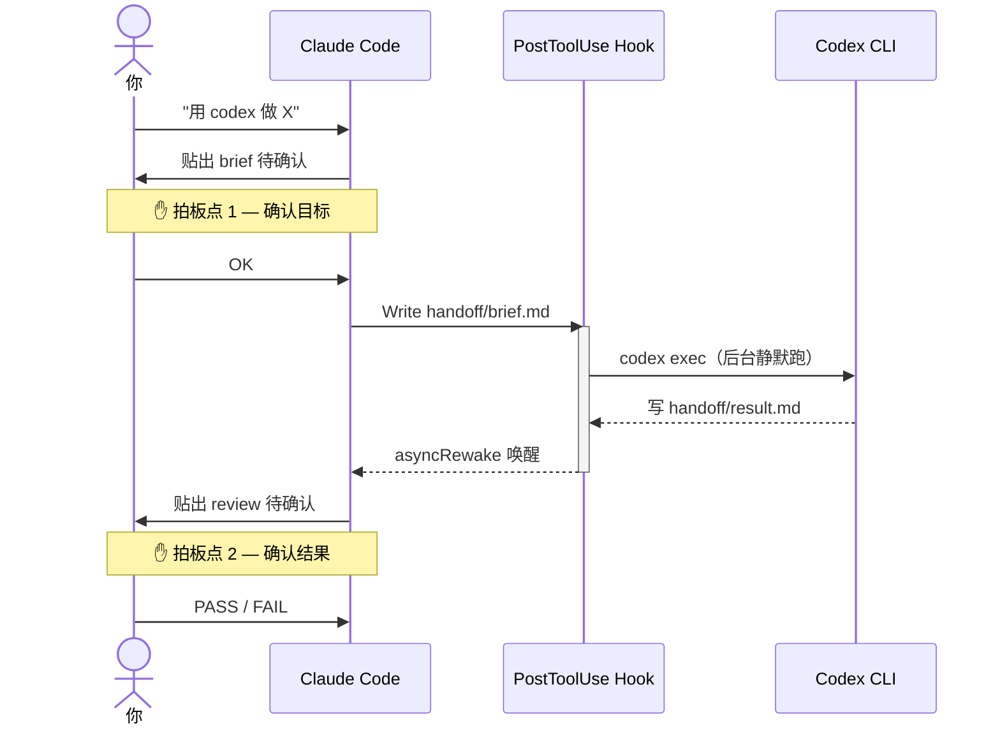

# Claude + Codex 双 AI 协作 hook


> Hook-driven bridge between Claude Code and Codex CLI — Claude plans, Codex codes, you approve.

---

<!-- 📹 TODO: 录一段 30s GIF 放这里 -->
<!-- 内容：说"用 codex 做 X" → brief 弹出 → 后台 codex 跑 → review 出来 → 你拍 PASS -->
<!-- 工具推荐：ScreenToGif (Windows 免费) -->

---

## 为什么做这个

之前的工作方式：让 Claude 写完方案，手动 copy 到 Codex 跑，看完结果再 copy 回来给 Claude review。来回切三个窗口，烦死。

现在：你跟 Claude 说"用 codex 做 X"，Claude 写好 brief，**后台自动喂给 Codex 执行**，跑完把 Claude 叫回来写 review，你只在两个地方拍板。其他全自动。

## 工作原理



两点之间你不用盯着。Claude 被叫醒之前去做别的也行。

## 快速开始

**前置依赖**

| 依赖 | 版本要求 |
|---|---|
| [Claude Code](https://claude.ai/code) | 支持 `asyncRewake: true` 的版本，用最新版 |
| [Codex CLI](https://github.com/openai/codex) | **>= 0.133**（旧版会报 model 不支持） |
| Windows + PowerShell | 5.1 或 7+；Linux/macOS 需自行改 bash |

```powershell
# 1. 克隆仓库
git clone https://github.com/Work-Fisher/claude-codex-relay.git
cd claude-codex-relay

# 2. 装 Codex CLI（没装过的话）
npm install -g @openai/codex@latest
codex --version   # 确认 >= 0.133

# 3. 改路径（把 C:\path\to\claude-codex-relay 换成你实际 clone 的位置）
#    文件: .claude/settings.json  →  hooks[0].command 里的 -File 参数

# 4. 新建一个 Claude Code 对话，说：
#    "用 codex 在 samples/ 里写一个 Python hello world"
#    → Claude 念 brief → 你回 OK → 等 1-2 分钟 → 看 review
```

> ⚠️ `settings.json` 不动态加载，改完必须**新建对话**才生效。

## 2 个拍板点

这是核心设计，不是额外步骤。AI 自治的最大风险是"跑飞了你不知道"，拍板点让你始终在环里：

| 拍板点 | 时机 | 你做什么 |
|---|---|---|
| **① brief 确认** | Claude 写完 brief、贴给你看 | 目标对不对，说 OK |
| **② review 确认** | Codex 跑完、Claude 写完 review | 结果对不对，说 PASS 或 FAIL |

## 什么时候用

**✅ 走这套**
- 中等新功能（1-3 个文件，< 100 行）
- 数据分析 / 写文档 / 研究任务
- 任何你想让 Codex 独立执行、不想盯着的事

**❌ 直接让 Claude 自己改**
- 修 typo / 改一行
- 重构旧代码（探索期出错风险高，中转成本不值）

## 安装详解

### 路径配置

打开 `.claude/settings.json`，把 `command` 字段改成你本地的**绝对路径**：

```json
"command": "powershell.exe -NoProfile -ExecutionPolicy Bypass -File \"C:\\你的路径\\claude-codex-relay\\hooks\\run-codex.ps1\""
```

注意 `\\` — JSON 里反斜杠要双写，写成 `C:\foo\bar` 会直接 parse 失败。

### BOM 验证（中文 Windows 必做）

PowerShell 5.1 在中文系统上读 BOM-less UTF-8 文件会按 GBK 解析，hook 脚本的 here-string 会炸，触发了也静默挂掉连 log 都不写。

```powershell
$b = [IO.File]::ReadAllBytes('hooks\run-codex.ps1')
"$($b[0]),$($b[1]),$($b[2])"   # 应输出 239,187,191
```

不对的话，修复命令在 `CLAUDE.md` 技术坑 #1。

### SKILL 安装（推荐）

安装后，**任何项目**里说"走 codex 做 X"就自动激活协议，不用每次手动解释规则：

```powershell
$dest = "$env:USERPROFILE\.claude\skills\claude-codex-relay"
New-Item -ItemType Directory -Force $dest | Out-Null
Copy-Item SKILL.md "$dest\SKILL.md"
```

## 已知坑

| 症状 | 原因 | 处理 |
|---|---|---|
| 说了要做，codex 没动 | 用 Edit 改了 brief，PostToolUse:Write 不匹配 Edit | brief 必须用 Write 重写整文件 |
| hook 不触发，`codex.log` 不存在 | `run-codex.ps1` 缺 BOM，PS 5.1 静默崩 | 验证前 3 字节 = 239,187,191 |
| `result.md` 是 0 字节 | codex 执行失败（常见：CLI 版本太旧） | `npm i -g @openai/codex@latest` |
| `result.md` 只有一句"已完成" | `apply_patch` 写完报告后 `--output-last-message` 把它盖了 | `python references/extract_result.py --latest --write` |
| 每次启动有一堆 MCP 报错噪声 | `~/.codex/config.toml` 里有过期 OAuth 的 MCP server | 注释掉没用的 `[mcp_servers.xxx]` |
| lock 卡死 | 上次没退出干净 | `Remove-Item handoff\codex.lock` |

完整技术坑（含原理 + 实测复现步骤）在 `CLAUDE.md`，第一次装建议扫一眼。

## 文件结构

```
claude-codex-relay/
├── .claude/
│   └── settings.json          # hook 配置，改 -File 路径那一行
├── hooks/
│   ├── run-codex.ps1          # 主 hook 脚本（必须 UTF-8 with BOM）
│   └── codex.log              # 运行日志（gitignored）
├── handoff/                   # 运行时目录（gitignored）
│   ├── brief.md               # Claude → Codex
│   ├── result.md              # Codex → Claude
│   └── review.md              # Claude → 你
├── references/
│   └── extract_result.py      # result.md 丢失时的恢复工具
├── SKILL.md                   # 复制到 ~/.claude/skills/ 后跨项目激活
├── CLAUDE.md                  # 项目级协议，新会话自动加载
└── JOURNEY.md                 # 决策复盘：7 轮拷问 + 排除的死路
```

## 没打算做的事

- **不做 Codex 反向唤醒 Claude**：试过 MCP 桥，Codex 自己说"MCP 解决工具结构化，不解决 GUI 唤醒"，死路。
- **不 fork Claude Code 改协议**：维护爆炸。
- **不为简单任务走这套**：改一行直接让 Claude 自己改，中转成本不值。

---

[](https://star-history.com/#Work-Fisher/claude-codex-relay&Date)

## License

MIT
